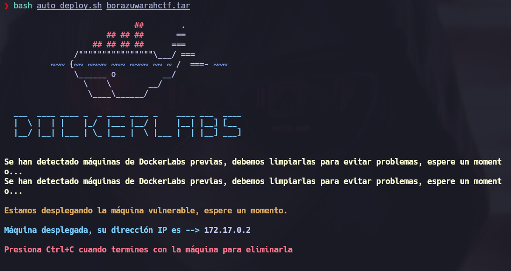
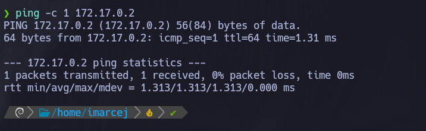
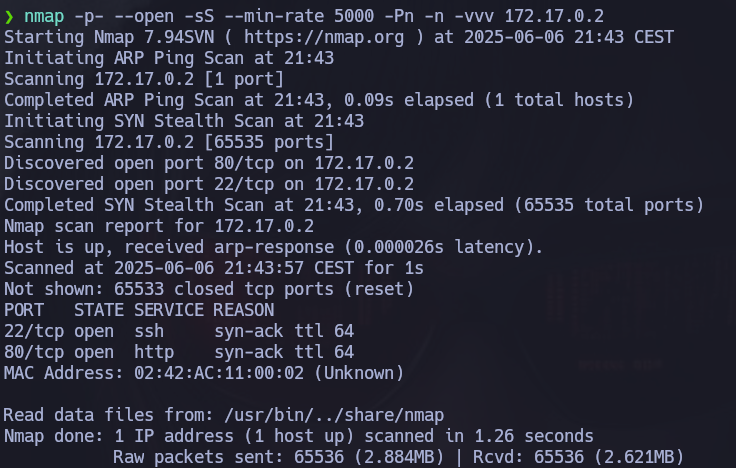
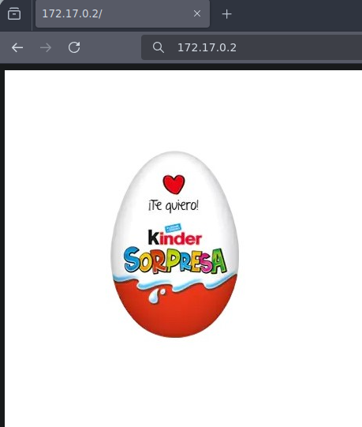
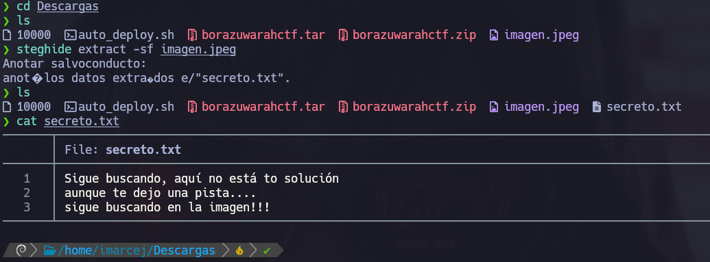
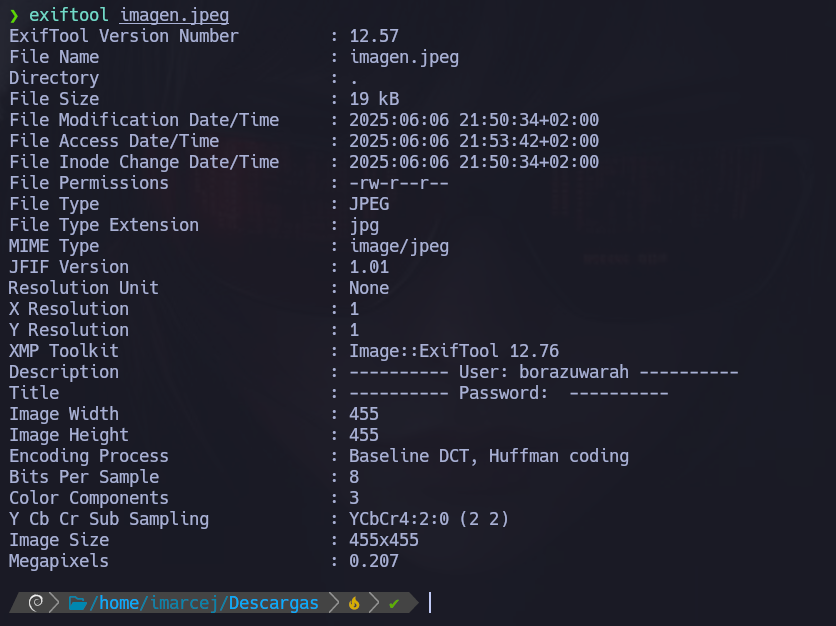
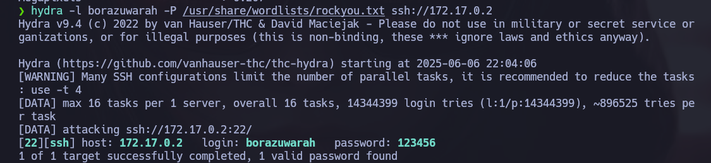
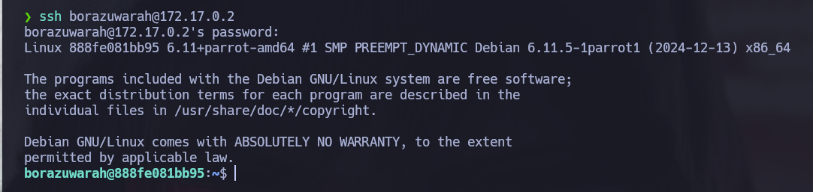
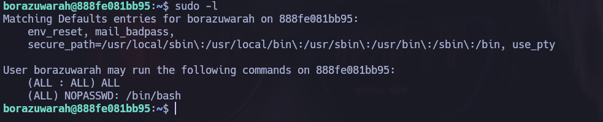
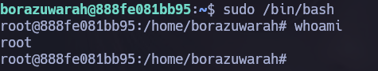

# 🧠 MÁQUINA BorazuwarahCTF

**Dificultad:** 🟢 Muy fácil

🔗 Puedes descargar la máquina desde aquí: [https://dockerlabs.es/](https://dockerlabs.es/)

---

## 1. Despliegue de la máquina vulnerable



---

## 2. Verificación de conectividad

Realizamos un **ping** para comprobar si está activa en la red:



---

## 3. Escaneo inicial con Nmap




Explicación detallada de cada parámetro:

- **-p-**: Hace un escaneo de todos los puertos (1-65535).
- **--open**: Muestra solo puertos abiertos.
- **-sS**: Nos permite hacer escaneos sigilosos y evitar la detección de firewall. Hace un escaneo de tipo SYN sin establecer conexión completa, y así evitar la detección del firewall.
- **--min-rate=5000**: Este parámetro nos ayuda a controlar la velocidad de los paquetes enviados y así poder hacer un escaneo más rápido con 5000 paquetes por segundo.
- **-Pn**: No realiza ping porque ya da por hecho que el host está activo.
- **-n**: No hace resolución DNS.
- **-vvv**: Modo verbose, para ir viendo información detallada en tiempo real.

Se encuentran abiertos los puertos 22 y 80, lo siguiente que haré es ir al navegador para ver que nos encontramos en el puerto 80.


---

## 4. Búsqueda de vulnerabilidades



He inspeccionado la imagen y no hay nada en el navegador, la descargaré y vemos que datos podemos encontrar..

---



Primero he utilizado **steghide** que es una herramienta que nos ayuda a ocultar y extraer archivos dentro de una imagen o archivos de sonido, el comando **extract** es una de las operaciones que steghide puede realizar, en este caso nos ayuda a extraer un archivo oculto que esté escondido dentro d ela imagen y la flag **-sf** stego file (archivo esteganográfico). Es decir, el archivo que aparentemente es "normal", pero que posiblemente contiene algo escondido.

Seguimos recopilando información de la imagen con esta pista...




---

Ahora utilizamos **exiftool**, es una herramienta que nos permite leer, escribir y editar metadatos de archivos, funciona con imágenes, vídeos, audios, PDFs, etc. Con esta herramienta podemos descubrir datos sensibles como por ejemplo: quién creó el documento, dónde se tomó una foto, si la imagen fue editada, si hay metadatos maliciosos o inusuales, etc. 

---

## 5. Explotación de vulnerabilidades

Ahora utilizaré fuerza bruta con hydra ya que tenemos un nombre:



---

Y nos ha dado una contraseña, ahora intentaremos entrar por ssh:



## 6. Escalada de privilegios

Ahora veremos que comando podemos ejecutar como root:



Podemos ejecutar cualquier comando (ALL). como cualquier usuario y podemos hacer ```sudo /bin/bash``` sin que me pida password.



Máquina resuelta exitosamente :)

📅 Resuelta el 06/06/25

👩 Por Marcela Jiménez (aka Mar)
🐉


