# 🧠 MÁQUINA BREAKMYSSH

**Dificultad:** 🟢 Muy fácil!

---

## 1. Despliegue de la máquina

Ejecutamos la máquina vulnerable:

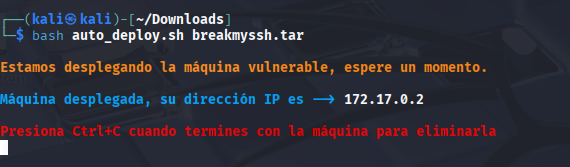

---
## 2. Verfifico la conectividad de la máquina

Realizo un **ping** para ver si está activa en la red:

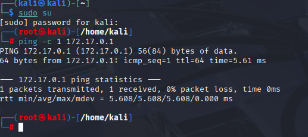

## 3. Reconocimiento con **NMAP**

Hago un escaneo completo para saber que puertos están abiertos: 

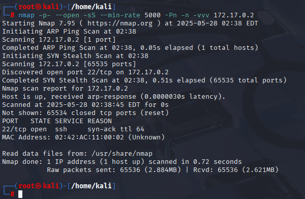

---

El puerto 22 está abierto, entonces ahora hago un escaneo al puerto 22 para ver las versiones que corren por detrás:

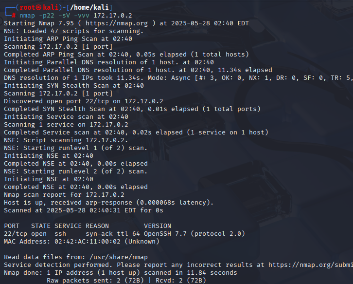

---

## 4. Búsqueda de vulnerabilidades

Ahora que ya tengo la versión voy a buscar exploits para esta versión:

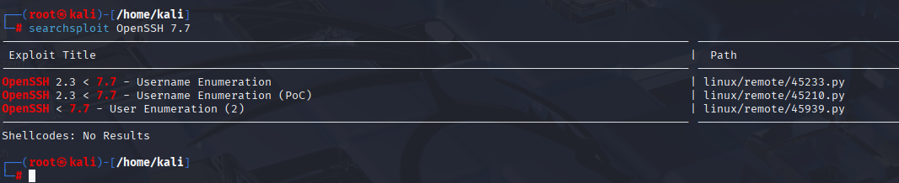

---

Ahora abriré Metasploit para enumerar usuarios, usando la herramienta:

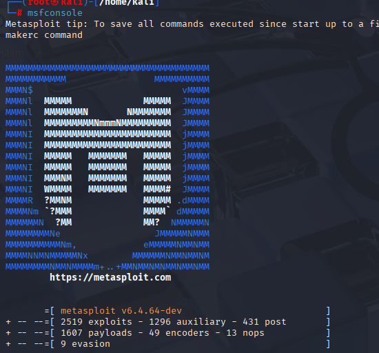

---

Ahora ejecuto el siguiente comando para poder entrar en la enumeración de usuarios y setear algunas cosas:

```bash
use auxiliary/scanner/ssh/ssh_enumusers
```

El siguiente paso es setear el RHOSTS y poner la ip de la víctima:

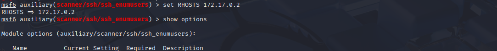

---
También tenemos que setear USER_FILE donde buscará los usuarios:

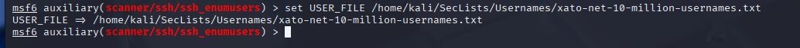

---

Luego verificamos con **show options** para ver los cambios:

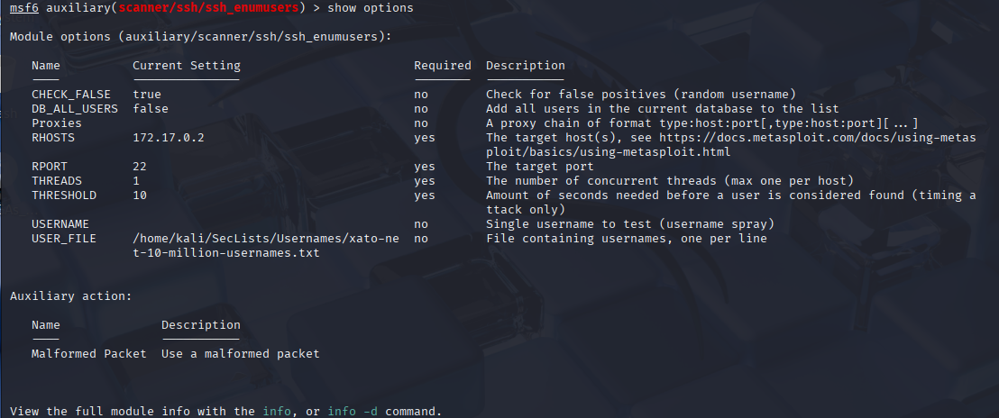

---

Luego ejecutamos run para lanzar el exploit:

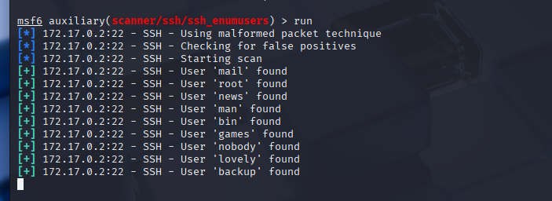

---

Nos ha detectado el usuario *lovely*

## 5. Explotación de vulnerabilidades

Ahora utilizaremos fuerza bruta con hydra, para el descubrimiento de la contraseña del usuario encontrado:

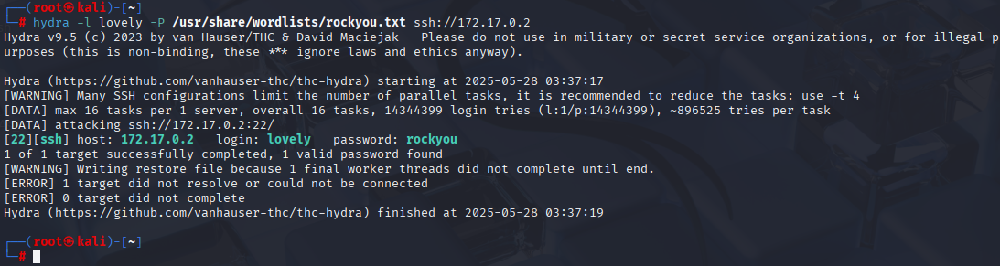

---

Nos ha descubierto la contraseña, el siguiente paso es entrar con ssh con el usuario *lovely*:

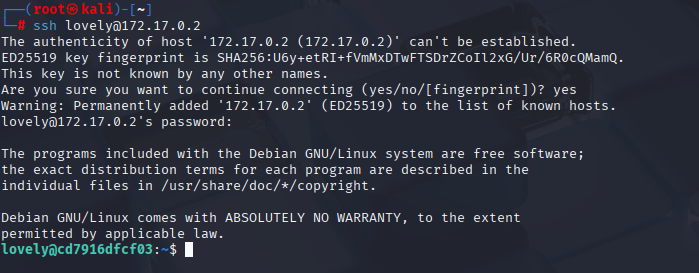

---

Entramos al opt para ver si hay algo oculto que nos ayude y vemos un .hash:

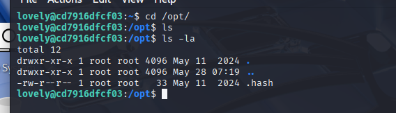

---
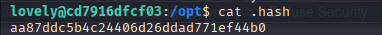

---

Ahora pondré este hash en la web en la página **crackstation.net**:

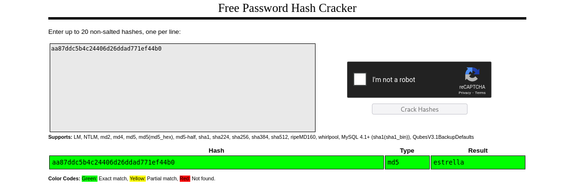

Nos ha dado la contraseña!!

## 6. Escalada de privilegios

Y ahora escalamos con su:

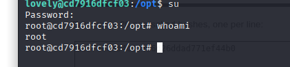

---

Máquina resuelta exitosamente :) 

📅 Resuelta el 28/05/25

👩 Por Marcela Jiménez (aka Mar)
🐉


