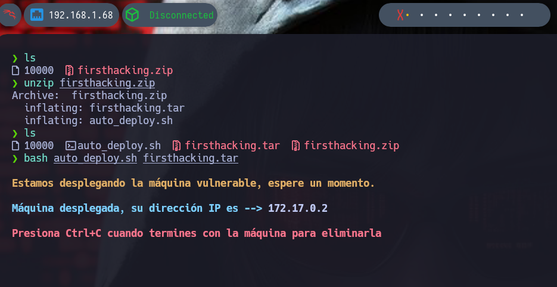
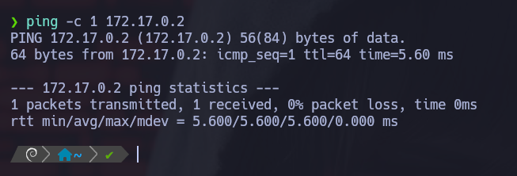
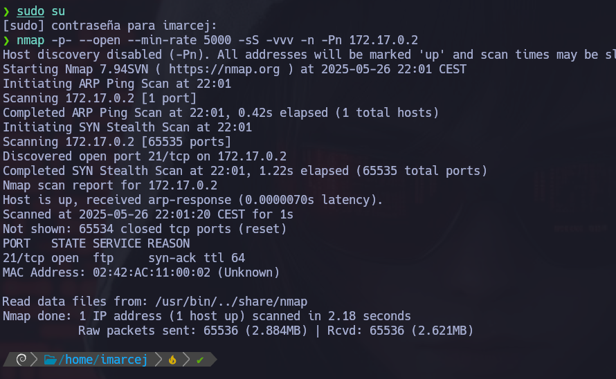
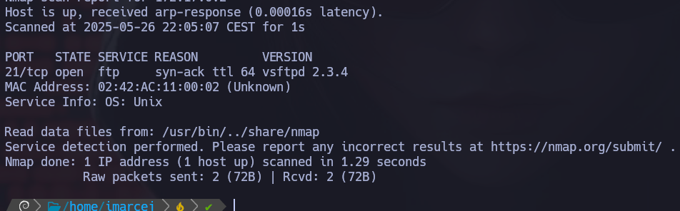
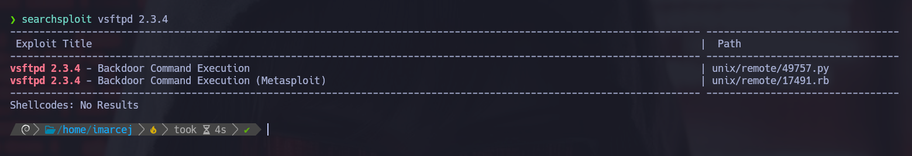
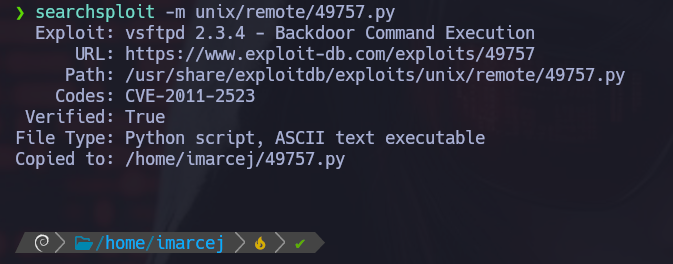
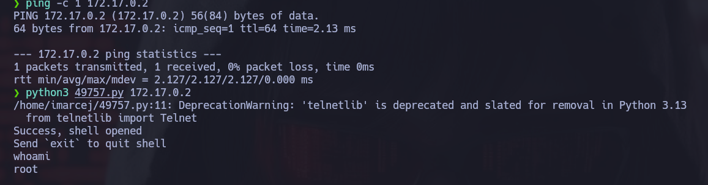

# 🧠 MÁQUINA FIRSTHACKING

**Dificultad:** 🟢 Muy fácil

---

## 1. Despliegue de la máquina

Ejecutamos la máquina vulnerable:



---

## 2. Verificación de conectividad

Realizamos un **ping** para comprobar si está activa en la red:



---

## 3. Escaneo inicial con Nmap



Se encuentra abierto el puerto **21 (FTP)** y el TTL sugiere que estamos ante una máquina **Linux**.

---

## 4. Escaneo detallado al puerto 21

```bash
nmap -p21 -sV -vvv 172.17.0.2
```



## 5. Búsqueda de vulnerabilidades
Con la versión del servicio FTP obtenida, usamos Searchsploit para buscar un exploit:



✅ ¡Exploit encontrado!

Lo copiamos al directorio actual con:

```searchsploit -m unix/49757.py```
📝 El flag -m (mirror) copia el archivo al directorio donde estamos trabajando.



6. Ejecución del exploit
Ejecutamos el script:



Estamos dentro como root!

✅ Máquina resuelta exitosamente.

📅 Resuelta el 26/05/25

👩 Por Marcela Jiménez (aka Mar)
🐉