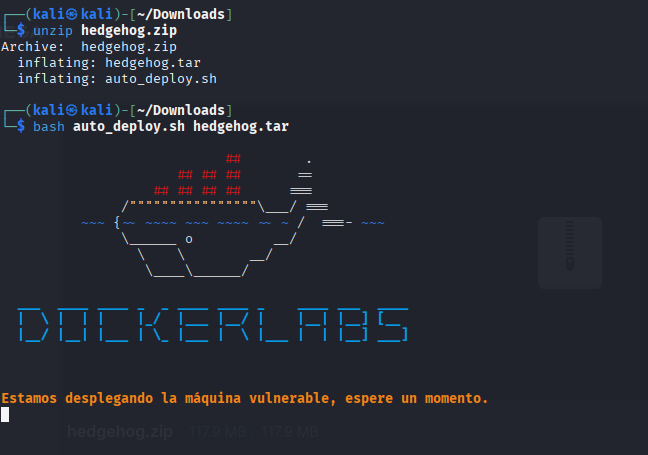
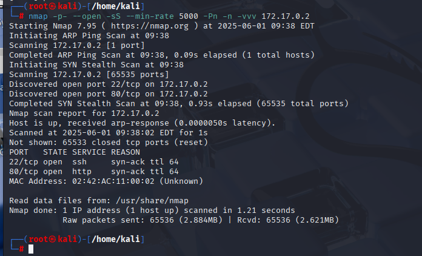
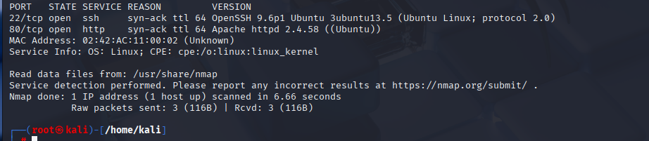
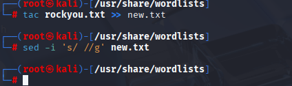
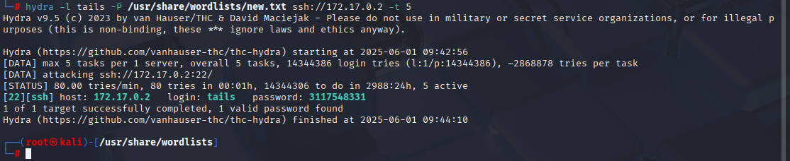
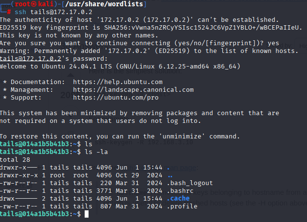
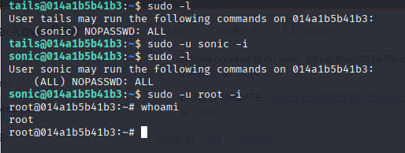

# 🧠 MÁQUINA HEDGEHOG

**Dificultad:** 🟢 Muy fácil

🔗 Puedes descargar la máquina desde aquí: [https://dockerlabs.es/](https://dockerlabs.es/)

---

## 1. Despliegue de la máquina vulnerable



---

## 2. Reconocimiento con **NMAP**



---

Ahora que hemos visto que el puerto 22 y el 80 están abiertos, vamos a ver sus versiones con el parámetro *-sV* ejecutando:

```bash
nmap -p22,80 -sV -n -vvv 172.17.0.2
```




---

El puerto 80 está abierto, vamos a escribir en el navegador: **http://172.17.0.2:80** y nos ha dado este nombre:


---

## 3. Explotación de vulnerabilidades

Ahora lo que haré es aplicar fuerza bruta con hydra con ese nombre.

Lo siguiente que haré es usar el comando **tac** ya que la contraseña podría estar en las últimas combinaciones de rockyou:



**tac**: Es un comando de linux que nos muestra el contenido en orden inverso, es decir(linea por línea, desde la última hasta la primera).

y lo voy a redirigir con **>>** al archivo **new.txt** si el archivo no existe, lo crea y si existe, añade el contenido al final del archivo sin sobreescribir sobre el.

Luego utilizo el comando **sed** que es un editor de flujo que permite procesar y editar texto. El flag **-i** nos editará el archivo directamente en su lugar, modificando el archivo original, sin hacer ninguna copia. **'s/ //g'**: Es una expresión que indica la operación de búsqueda y reemplazo: **s**: Indica una operación de sustitución.
**/**: El espacio dentro de las primeras barras indica que se busca un espacio en blanco.
**/g/**: El modificador g significa *global*, lo que significa es que reemplazará todos los espacios encontrados en cada línea del archivo. Lo que el comando completo hace es eliminar todos los espacios en blanco del archivo.

---

Ahora vamos a utilizar fuerza bruta con **hydra** aplicando lo de el comando **tac** en el nuevo archivo:



----

Ya que tenemos la contraseña de ese usuario, vamos a entrar por **ssh**:



---

## 4. Escalada de Privilegios

Ahora lo primero que haré es ver si puedo ejecutar algún comando como root con este usuario:



Y lo primero que vemos que el usuario **sonic** puede ejecutar comandos como root, entonces nos convertimos en sonic y el siguiente paso es escalar con sudo.

Máquina resuelta exitosamente :)

📅 Resuelta el 01/06/25

👩 Por Marcela Jiménez (aka Mar)
🐉