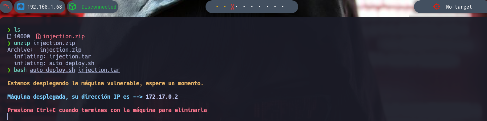
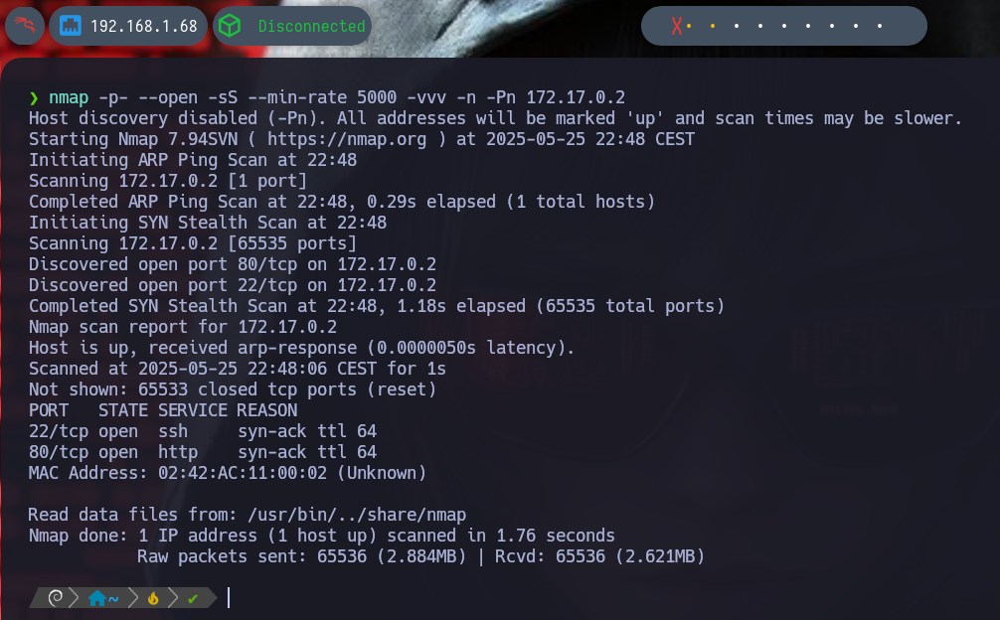
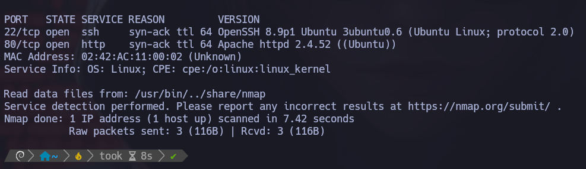
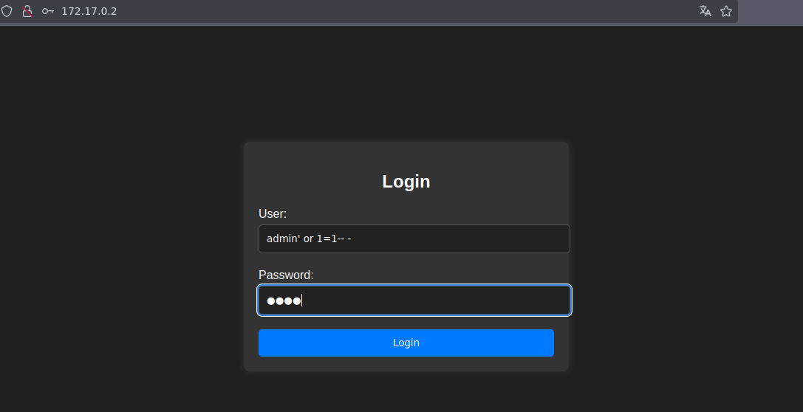
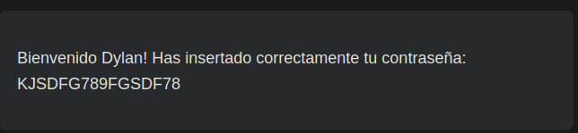
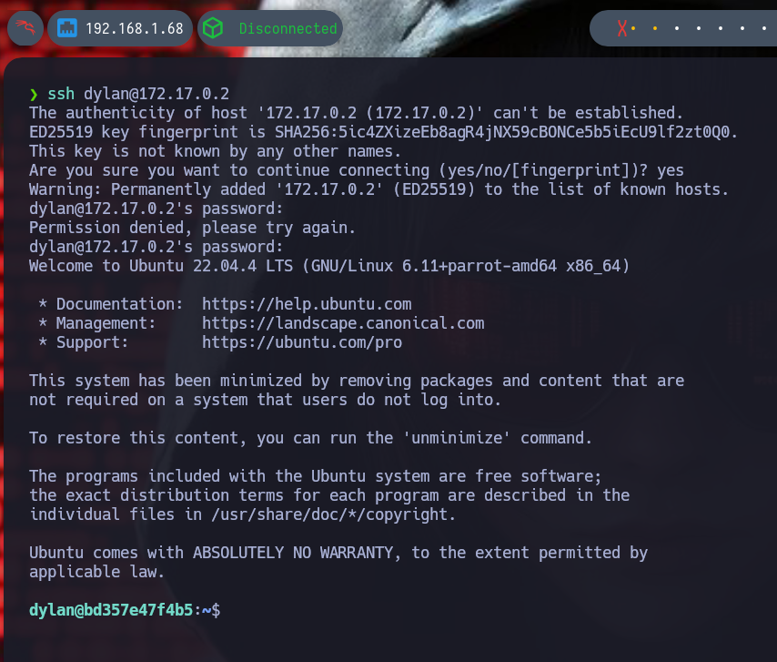
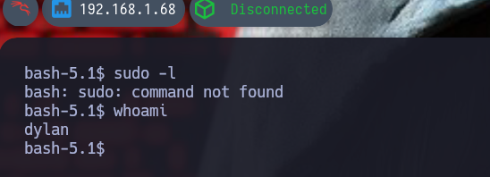
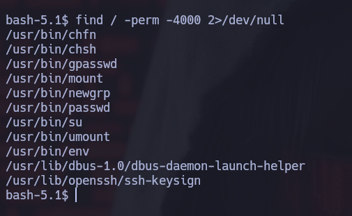
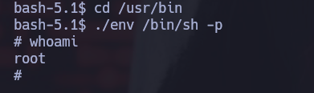

# 🧠 MÁQUINA INJECTION

**Dificultad:** 🟢 Muy fácil

🔗 Puedes descargar la máquina desde aquí: [https://dockerlabs.es/](https://dockerlabs.es/)

---

## 1. Despliegue de la máquina vulnerable

Ejecutamos los siguientes comandos:



---

## 2. Escaneo de puertos con Nmap



Explicación detallada de cada parámetro:

- **-p-**: Hace un escaneo de todos los puertos (1-65535).
- **--open**: Muestra solo puertos abiertos.
- **-sS**: Nos permite hacer escaneos sigilosos y evitar la detección de firewall. Hace un escaneo de tipo SYN sin establecer conexión completa, y así evitar la detección del firewall.
- **--min-rate=5000**: Este parámetro nos ayuda a controlar la velocidad de los paquetes enviados y así poder hacer un escaneo más rápido con 5000 paquetes por segundo.
- **-Pn**: No realiza ping porque ya da por hecho que el host está activo.
- **-n**: No hace resolución DNS.
- **-vvv**: Modo verbose, para ir viendo información detallada en tiempo real.


Se detectan dos puertos abiertos:

- **22 (SSH)**
- **80 (HTTP)**

Además, el TTL es **64**, lo que indica que probablemente se trata de una máquina **Linux**.

---

## 3. Escaneo detallado de puertos

```bash
nmap -p22,80 -sS --min-rate 5000 -sV -Pn -vvv 172.17.0.2
```





Se detecta Apache HTTPD 2.4.52 en el puerto 80.

## 4. Acceso web y SQL Injection
Abrimos en el navegador:
👉 http://172.17.0.2

Encontramos un panel de login.

Dado que la máquina se llama Injection, probamos una inyección SQL:

Usuario: admin' or 1=1-- -

Contraseña: (cualquier cosa)





 ¡Acceso exitoso!

## 5. Acceso por SSH
Observamos que el usuario se llama Dylan. Intentamos conectarnos por SSH:


Insertamos la contraseña y accedemos correctamente.

## 6. Privilegios y escalada
Intentamos usar sudo, pero no tenemos permisos:



Buscamos archivos con permisos SUID:



Encontramos que el binario env tiene permisos SUID.

## 7. Escalada a root
Entramos a /usr/bin y ejecutamos env con los privilegios adecuados:




🎉 ¡Ya somos root! Máquina comprometida y resuelta.

✅ Máquina completada con éxito.

📅 Resuelta el 26/05/25

👩Por Marcela Jiménez (aka Mar)
🐉


