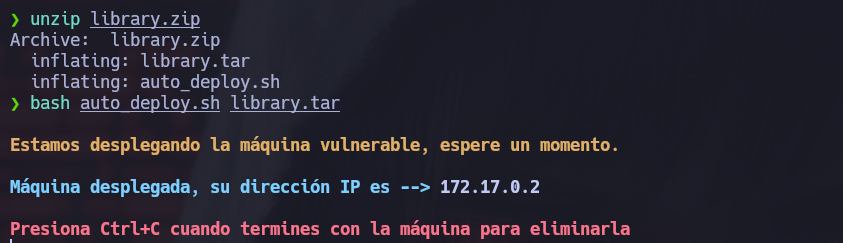
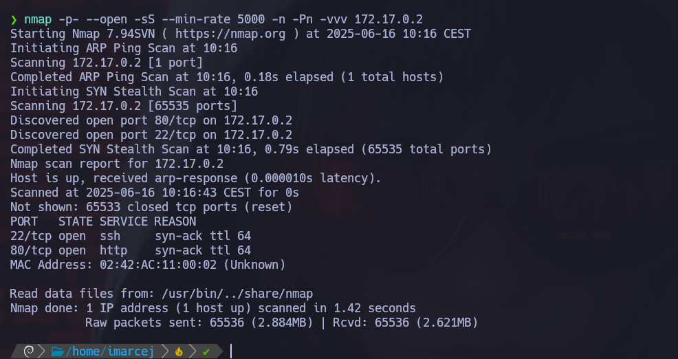
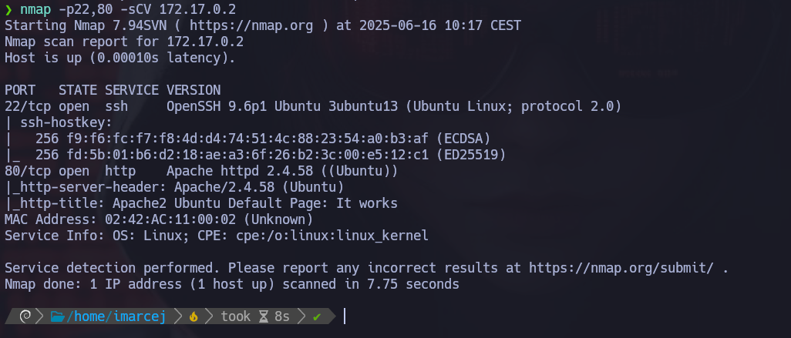
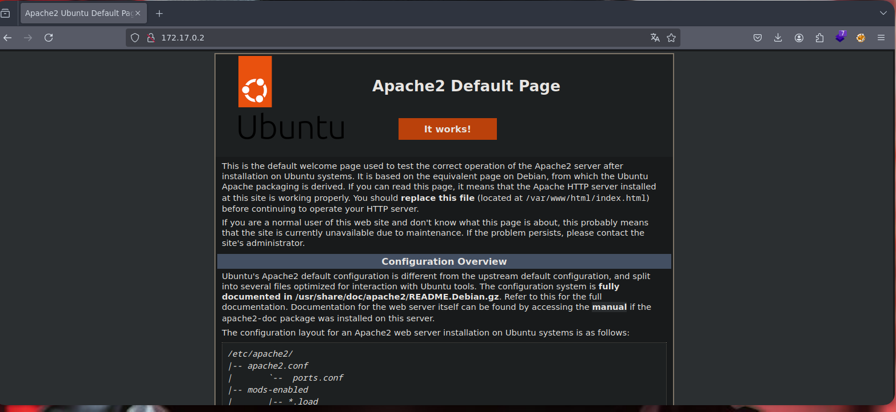
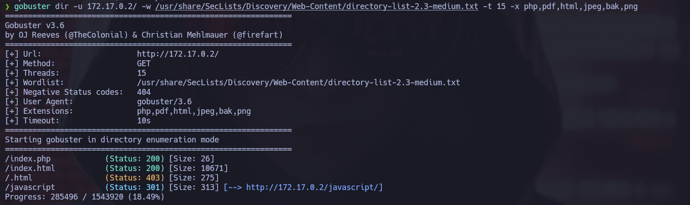
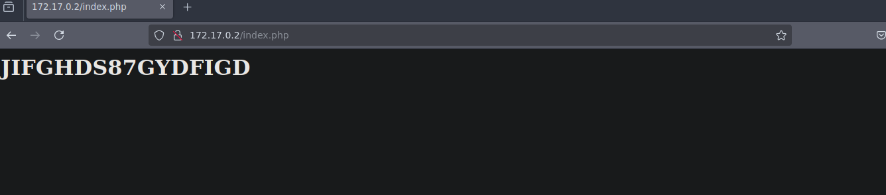
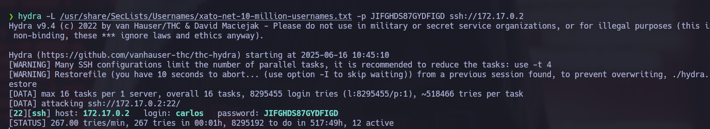
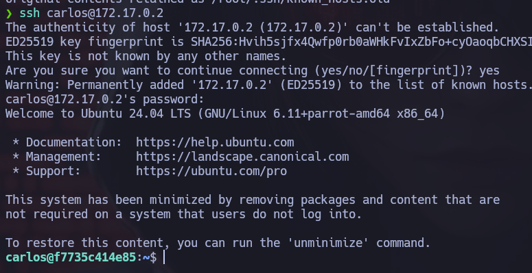
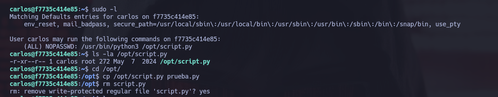
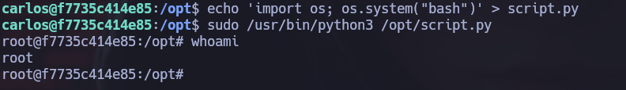

# 🧠 MÁQUINA LIBRARY

**Dificultad:** 🟢 Fácil

🔗 Puedes descargar la máquina desde aquí: [https://dockerlabs.es/](https://dockerlabs.es/)

---

## 1. Despliegue de la máquina vulnerable



---

## 2. Reconocimiento con **NMAP**



---

Explicación detallada de cada parámetro:

- **-p-**: Hace un escaneo de todos los puertos (1-65535).
- **--open**: Muestra solo puertos abiertos.
- **-sS**: Nos permite hacer escaneos sigilosos y evitar la detección de firewall. Hace un escaneo de tipo SYN sin establecer conexión completa, y así evitar la detección del firewall.
- **--min-rate=5000**: Este parámetro nos ayuda a controlar la velocidad de los paquetes enviados y así poder hacer un escaneo más rápido con 5000 paquetes por segundo.
- **-Pn**: No realiza ping porque ya da por hecho que el host está activo.
- **-n**: No hace resolución DNS.
- **-vvv**: Modo verbose, para ir viendo información detallada en tiempo real.


El puerto 80 y el 22 están abiertos, ahora voy a escanear esos dos puertos para ver las versiones que corren detrás:



---

No hemos encontrado nada interesante en las versiones.

## 3. Análisis web y descubrimiento de vulnerabilidades

Abrimos el navegador para ver que hay en la página:



Tenemos un servidor de **Apache** corriendo en el puerto 80. 

Ahora utilizaremos **gobuster** para encontrar rutas ocultas:



---

Y nos llama la atención la siguiente ruta:

```bash
index.php
```

Abrimos el navegador y nos encontramos con esta clave, que puede ser una posible contraseña de algún usuario:



---

## 4. Explotación de vulnerabilidades:

Utilizaremos **hydra** para que nos haga fuerza bruta, para que nos ayude a encontrar algún usuario con este diccionario y con la contraseña que hemos encontrado, ejecutaremos lo siguiente:



Y nos ha descubierto un usuario **carlos**, procedemos a entrar por SSH:



---

## 5. Escalada de privilegios:



Tras verificar los permisos de sudo disponibles para el usuario **carlos**, podemos ejecutar este script como sudo, este script copia el archivo **/opt/script.py** a **/tmp/script_backup.py** usando *shutil.copy()*. Y como se ejecuta como sudo, la copia se hace como root, entonces cualquier cosa que ese script copie (como root) será propiedad de root.

Entonces lo primero que haré es copiarme el archivo **/opt/script.py** a **prueba.py** y procedo a eliminar el **script.py**.

Ahora lo que haremos es en un nuevo archivo llamado igual **script.py** lanzar este **script** para que nos dé una **bash**:



Y procedemos a ejecutar el binario, y ya somos root.


Máquina resuelta exitosamente.

---

📅 Resuelta el 16/06/25

👩 Por Marcela Jiménez (aka Mar)
🐉


