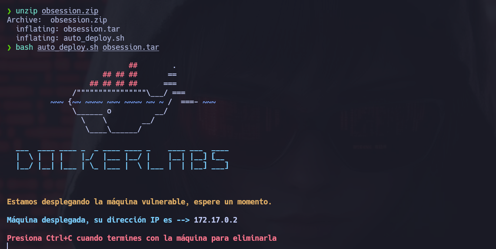
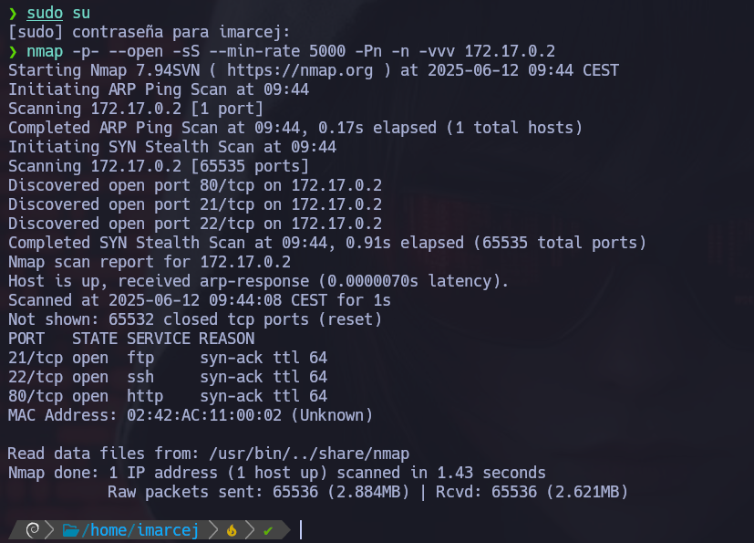
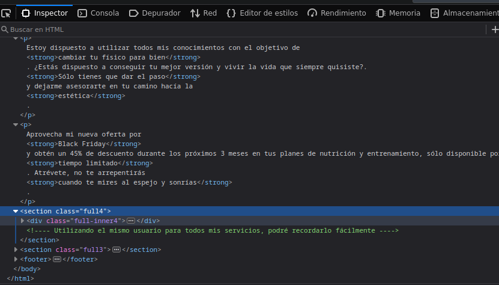
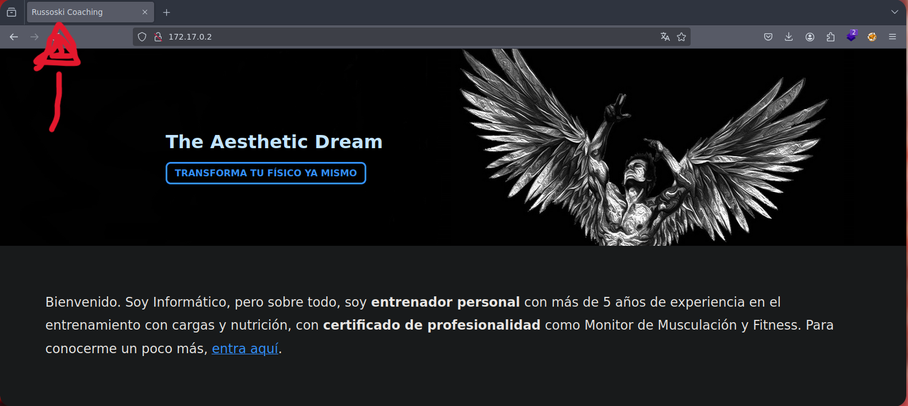
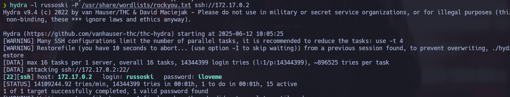
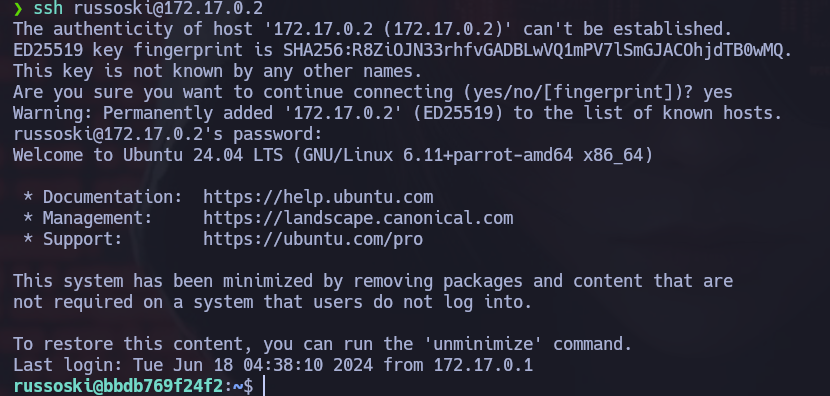
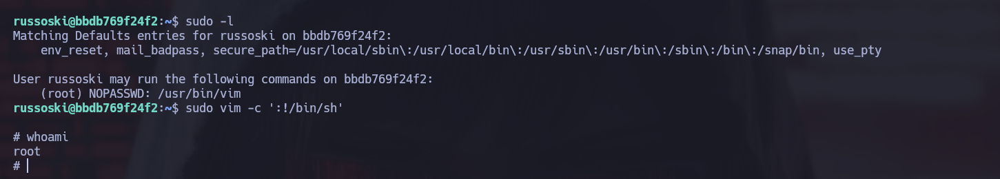

# 🧠 MÁQUINA OBSESSION

**Difícultad**: 🟢 Muy fácil

🔗 Puedes descargar la máquina desde aquí: [https://dockerlabs.es/](https://dockerlabs.es/)

---

## 1. Despliegue de la máquina vulnerable

---

## 2. Escaneo con NMAP

Encontramos los puertos 21, 22 y 80 abiertos.

Explicación detallada de cada parámetro:

- **-p-**: Hace un escaneo de todos los puertos (1-65535).
- **--open**: Muestra solo puertos abiertos.
- **sS**: Nos permite hacer escaneos sigilosos y evitar la detección de firewall. Hace un escaneo de tipo SYN sin establecer conexión completa, y así evitar la detección del firewall.
- **--min-rate=5000**: Este parámetro nos ayuda a controlar la velocidad de los paquetes enviados y así poder hacer un escaneo más rápido con 5000 paquetes por segundo.
- **-Pn**: No realiza ping porque ya da por hecho que el host está activo.
- **-n**: No hace resolución DNS.
- **-vvv**: Modo verbose, para ir viendo información detallada en tiempo real.

## 3. Búsqueda de vulnerabilidades

Lo primero que hice fue inspeccionar la página montada en apache, y con esta pista del mensaje comentado en el **html** "Utilizando el mismo usuario para todos mis servicios, podré recordarlo fácilmente"

Entonces, como la máquina se llama **obsession** y con el mensaje que dejó en el código html intentaré hacer fuerza bruta con **hydra** con el nombre que aparece en el inicio **russoski**:

## 4. Explotación de vulnerabilidades

Y hemos entrado, ahora entraremos por **ssh**:

---

## 5. Escalada de privilegios

Ahora veremos que podemos ejecutar como root con este usuario:

y vemos que podemos escalar con **vim**, para saber como escalar cada binario he utilizado una herramienta que nos dice como escalar en cada caso.

- El link de la herramienta es el siguiente:

[gtfobins](https://gtfobins.github.io)

Máquina resuelta exitosamente :)

---

📅 Resuelta el 12/06/25

👩 Por Marcela Jiménez (aka Mar)
🐉

