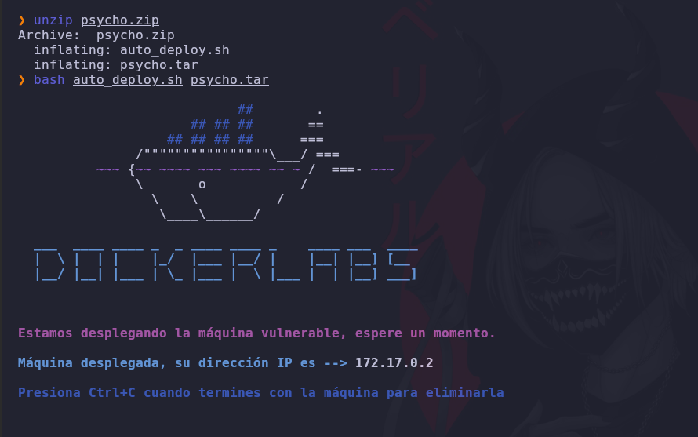
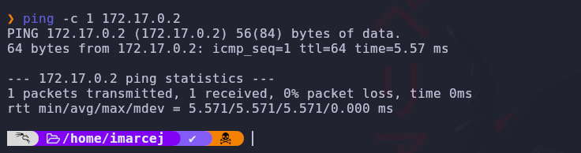
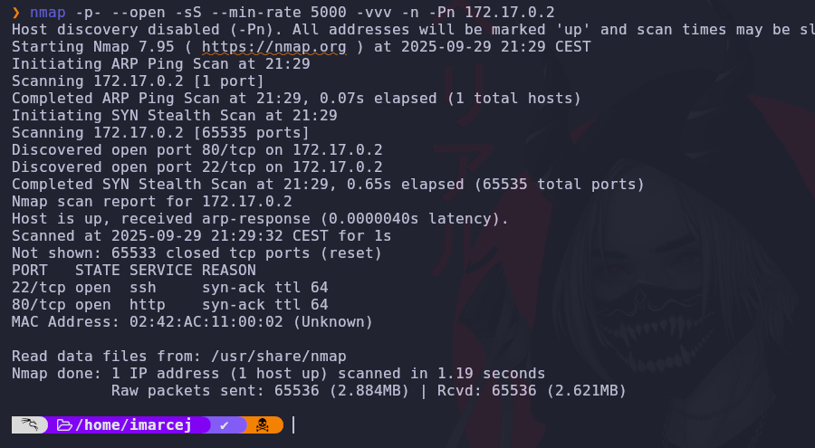
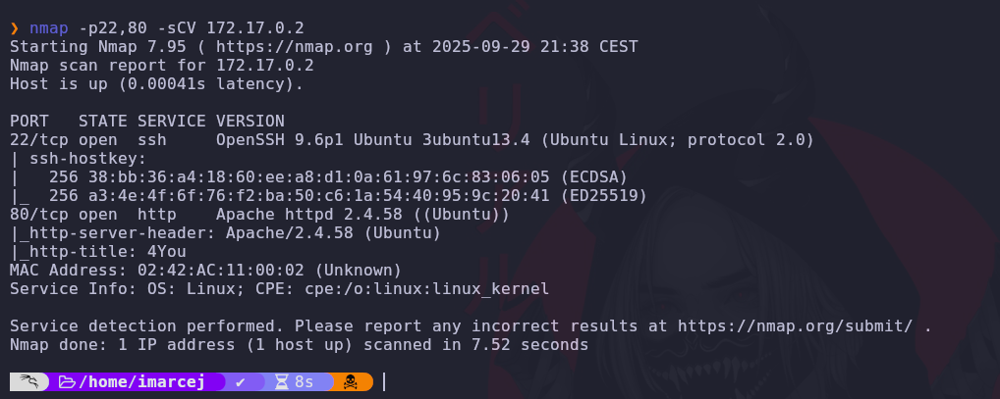

# Psyco Machine 🧠 

Difficulty: 🟢 Easy

🔗 You can download the machine here:
[https://dockerlabs.es/](https://dockerlabs.es/)

---

## 1. Deployment of the vulnerable machine

---

## 2. We send a ping to find out if the machine is active on the network.

---

## 3. Reconnaissance with nmap

Detailed explanation of each parameter:

- **-p-**: Scans all ports.
- **--open**: Show only open ports.
- **--min-rate=5000**: This parameter helps us control the speed of the packets sent and thus be able to perform a faster scan with 5000 packets per second.
- **-Pn**: It does not ping because it assumes the host is up..
- **-n**: It does not do DNS resolution.

Port 80 and port 22 are open. Now I'm going to scan those two ports to see what versions they're running behind.

