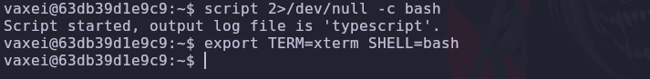
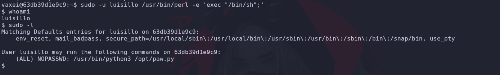
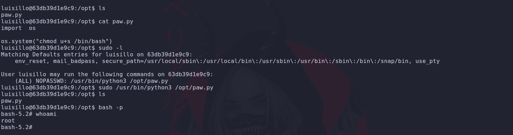

# Psyco Machine 🧠 

Difficulty: 🟢 Easy

🔗 You can download the machine here:
[https://dockerlabs.es/](https://dockerlabs.es/)

---

## 1. Deployment of the vulnerable machine


---

## 2. We send a ping to find out if the machine is active on the network.


---

## 3. Reconnaissance with nmap


Detailed explanation of each parameter:

- **-p-**: Scans all ports.
- **--open**: Show only open ports.
- **--min-rate=5000**: This parameter helps us control the speed of the packets sent and thus be able to perform a faster scan with 5000 packets per second.
- **-Pn**: It does not ping because it assumes the host is up..
- **-n**: It does not do DNS resolution.
- **-vvv**: Verbose mode, to view detailed information in real time.


Port 80 and port 22 are open. Now I'm going to scan those two ports to see what versions they're running behind.


We did not find any vulnerabilities in the versions.

---


We will take a look at the web page that is running on port 80


When reviewing the page, we noticed an error message at the end.

## 4. Fuzzing with ffuf

Remember, the page returned an error, which suggests you may be trying to access a resource incorrectly.We can use ffuf to find out which extensions the page is using and then discover the vulnerable parameter(I put index because it is a default name on web pages).


We discovered that it uses phps and php extensions


We have discovered that the vulnerable parameter is "secret".


Two users appear here, luisillo and vaxei. With the SSH port active, we'll try to get the id_rsa file for one of them.

Luisillo doesn't have this file, but vaxei does, so we'll use it to try to access it.


---

## 5. Intrusion as a vaxei user


We copy the contents of the id_rsa file to our machine and adjust the permissions before connecting:


We treat TTY:



---


By running sudo -l, we notice that vaxei has permissions to run perl as luisillo. Using [GTFOBins](https://gtfobins.github.io/gtfobins/awk/#shell) we know how to exploit these binaries.


```bash 
sudo -u luisillo /usr/bin/perl -e 'exec "/bin/sh";'
```



By running sudo -l, we notice that luisillo has permissions to run python3 as root in /opt/paw.py. Using [GTFOBins](https://gtfobins.github.io/gtfobins/awk/#shell) we know how to exploit these binaries.


Analyzing the script, we see that we can perform Library Hijacking by creating a subprocess.py file that executes arbitrary commands when running this script as sudo. 

Any user can write to the /opt directory, which
allows the paw.py file to be replaced with a malicious script.

We create a new paw.py and give it permissions

We run the script:



We are now root!

---

📅 Resolved on 29/09/2025

By Marcela Jiménez (aka Mar)
🐉