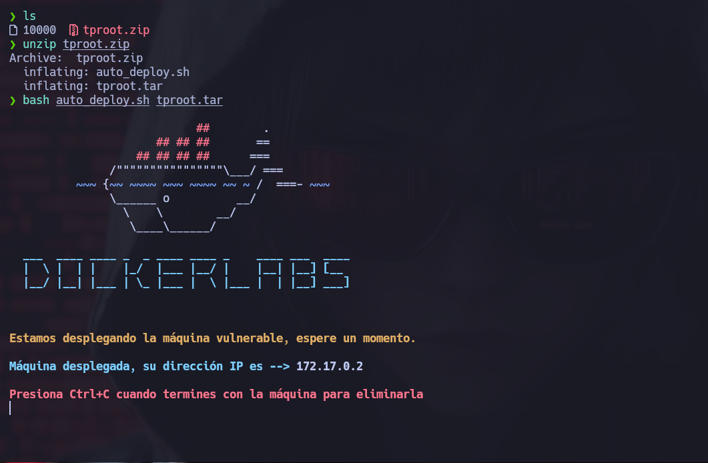
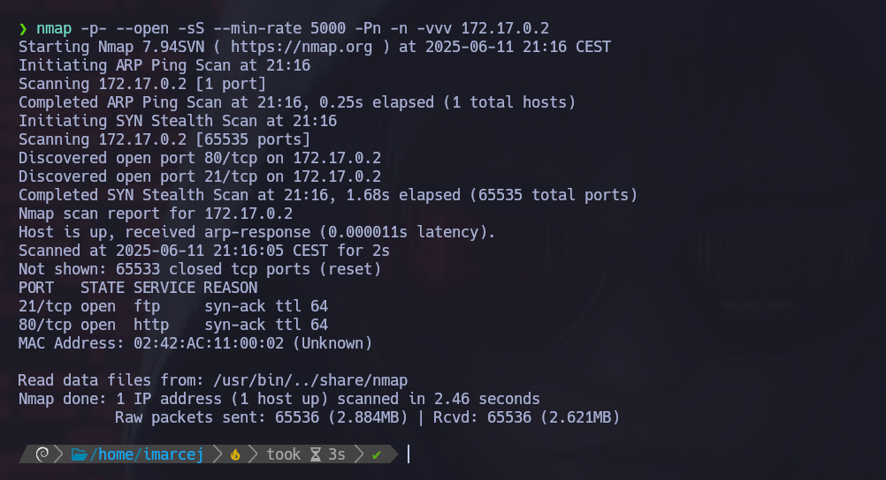
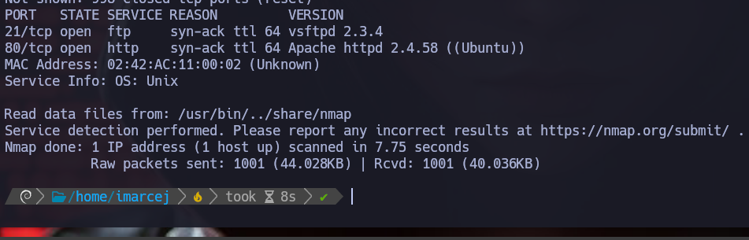
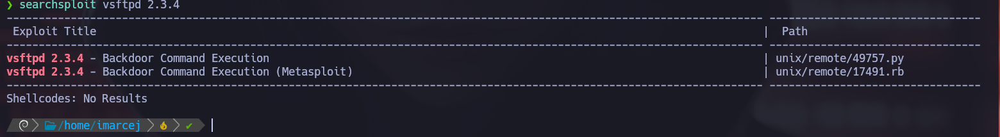
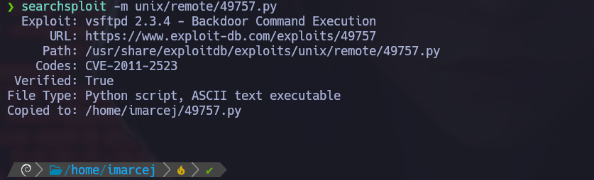
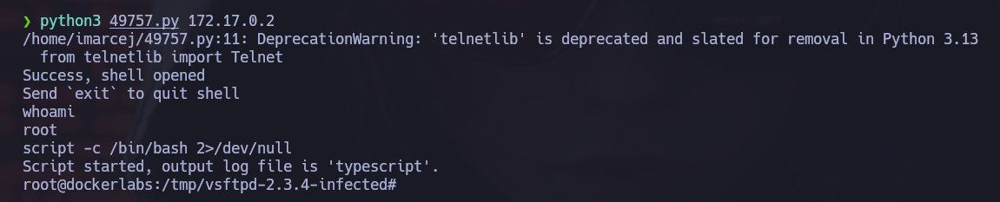

# 🧠 MÁQUINA TPROOT

**Difícultad**: 🟢 Muy fácil

🔗 Puedes descargar la máquina desde aquí: [https://dockerlabs.es/](https://dockerlabs.es/)

---

## 1. Despliegue de la máquina vulnerable



---

## 2. Reconocimiento con NMAP



---

Explicación detallada de cada parámetro:

- **-p-**: Hace un escaneo de todos los puertos (1-65535).
- **--open**: Muestra solo puertos abiertos.
- **-sS**: Nos permite hacer escaneos sigilosos y evitar la detección de firewall. Hace un escaneo de tipo SYN sin establecer conexión completa, y así evitar la detección del firewall.
- **--min-rate=5000**: Este parámetro nos ayuda a controlar la velocidad de los paquetes enviados y así poder hacer un escaneo más rápido con 5000 paquetes por segundo.
- **-Pn**: No realiza ping porque ya da por hecho que el host está activo.
- **-n**: No hace resolución DNS.
- **-vvv**: Modo verbose, para ir viendo información detallada en tiempo real.


Ahora voy a ver las versiones que corren detrás del puerto 21 y 80 con el parámetro **-sV** con NMAP, este es el comando completo:

```bash
nmap -sV -vvv 172.17.0.2
```




## 3. Búsqueda de vulnerabilidades

Ahora vamos a buscar algún **exploit** para el servicio que corre detrás del puerto 21:



Y como hemos encontrado un **exploit** vamos a seleccionarlo:



## 4. Escalada de privilegios

Y ahora ejecutamos el exploit y hemos entrado



y ya somos root, máquina resuelta exitosamente :)

---


📅 Resuelta el 11/06/25

👩 Por Marcela Jiménez (aka Mar)
🐉


