# 🧠 MÁQUINA TRUST

**Dificultad:** 🟢 Muy fácil

🔗 Puedes descargar la máquina desde aquí: [https://dockerlabs.es/](https://dockerlabs.es/)

---

## 1. Despliegue de la máquina vulnerable

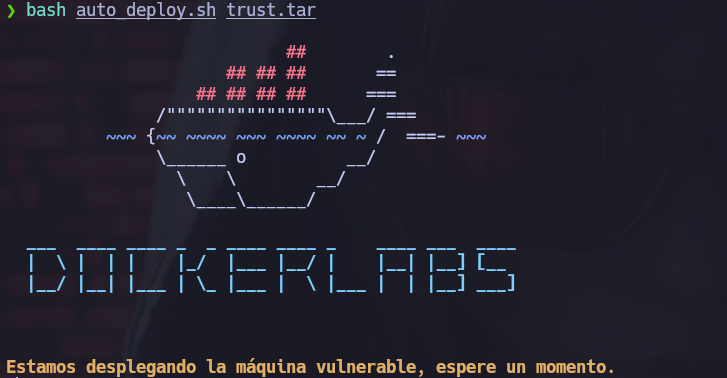

---

## 2. Reconocimiento con **NMAP**

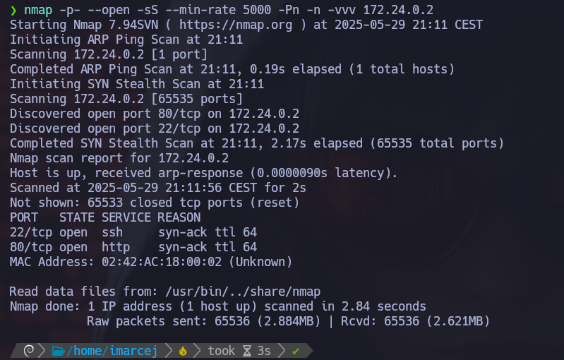

---
El puerto 80 y el 22 están abiertos, ahora voy a escanear esos dos puertos para ver las versiones que corren detrás:

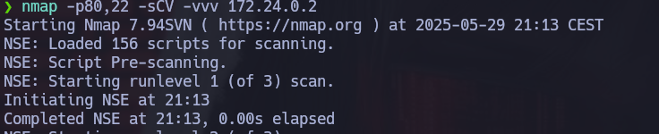

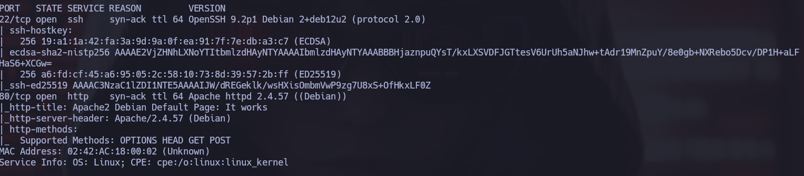

--- 

## 3. Enumeración de rutas con **FFUZ**
Lo primero que haré es ejecutar **ffuf** para que me enumere rutas ocultas que corren detrás de Apache, por ejemplo: php, html:

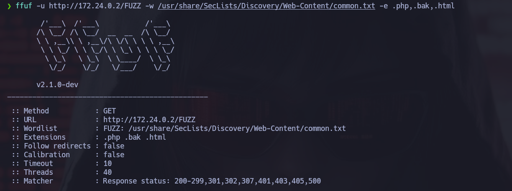

---
Y efectivamente me ha descubierto un archivo **secret.ph**:

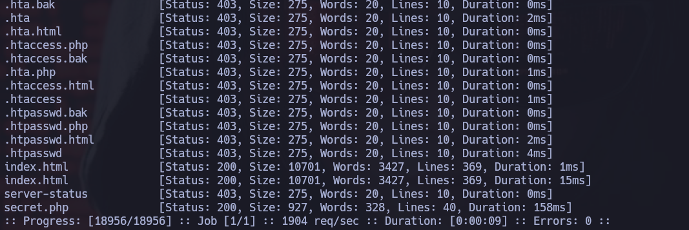

---

Y la ruta nos da un nombre:

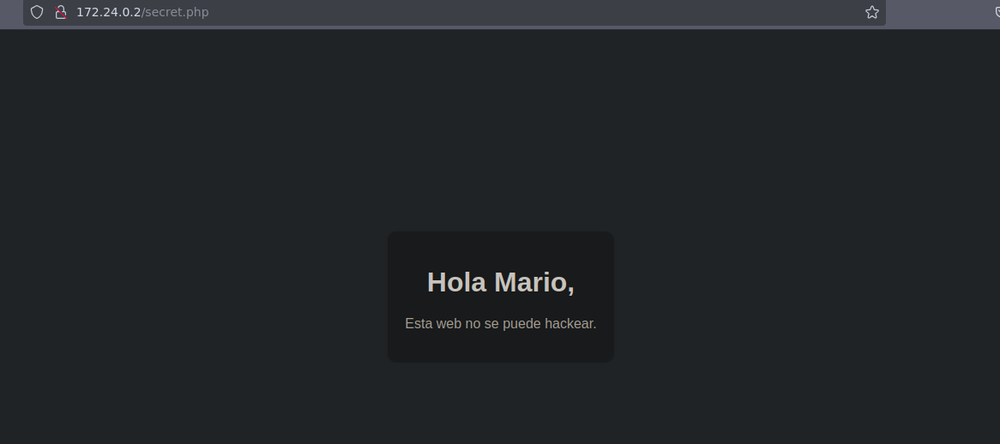

---

## 4. Explotación de vulnerabilidades

Ahora utilizaré fuerza bruta con hydra ya que tenemos un nombre:

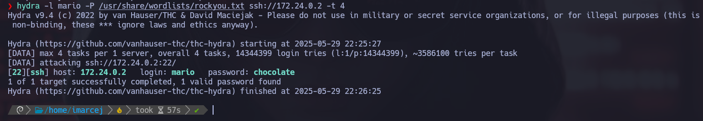

---

Y nos ha dado una contraseña, ahora intentaremos entrar por ssh:

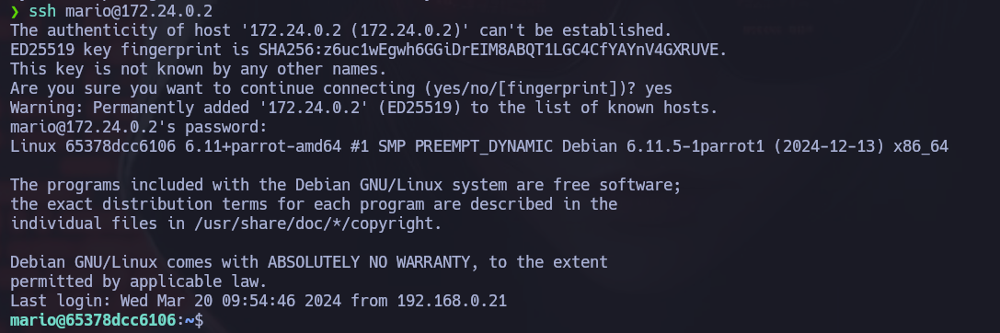

---

## 5. Escalada de Privilegios

Ya estando dentro, ejecutaré este comando para ver si puedo ejecutar algún comando como root sin contraseña:

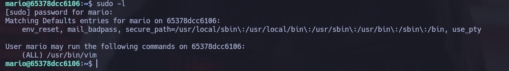

---

Esto significa que puedo ejecutar vim como root usando sudo, sin necesidad de contraseña.

El siguiente paso es obtener una shell como root ejecutando:

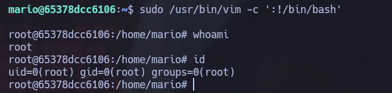

---

Y ya somos root, máquina resuelta exitosamente.

📅 Resuelta el 29/05/25

👩 Por Marcela Jiménez (aka Mar)
🐉

