-------# 🧠 MÁQUINA TRUST

**Dificultad:** 🟢 Muy fácil

🔗 Puedes descargar la máquina desde aquí: [https://dockerlabs.es/](https://dockerlabs.es/)

---

## 1. Despliegue de la máquina vulnerable

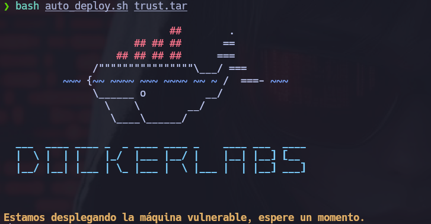

---

## 2. Reconocimiento con **NMAP**

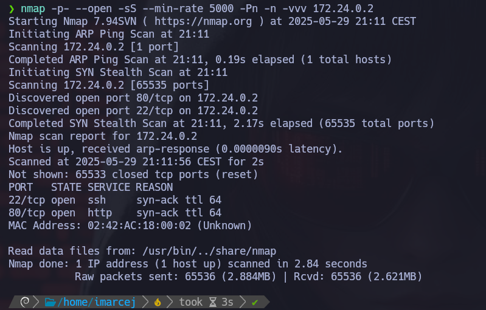

---

Explicación detallada de cada parámetro:

- **-p-**: Hace un escaneo de todos los puertos (1-65535).
- **--open**: Muestra solo puertos abiertos.
- **-sS**: Nos permite hacer escaneos sigilosos y evitar la detección de firewall. Hace un escaneo de tipo SYN sin establecer conexión completa, y así evitar la detección del firewall.
- **--min-rate=5000**: Este parámetro nos ayuda a controlar la velocidad de los paquetes enviados y así poder hacer un escaneo más rápido con 5000 paquetes por segundo.
- **-Pn**: No realiza ping porque ya da por hecho que el host está activo.
- **-n**: No hace resolución DNS.
- **-vvv**: Modo verbose, para ir viendo información detallada en tiempo real.

El puerto 80 y el 22 están abiertos, ahora voy a escanear esos dos puertos para ver las versiones que corren detrás:

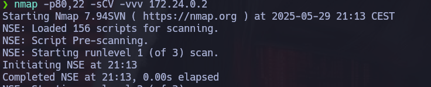

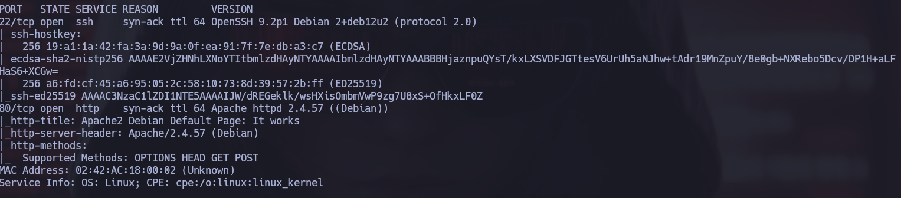

--- 

## 3. Enumeración de rutas con **FFUF**
Lo primero que haré es ejecutar **ffuf** para que me enumere rutas ocultas que corren detrás de Apache, por ejemplo: php, html:

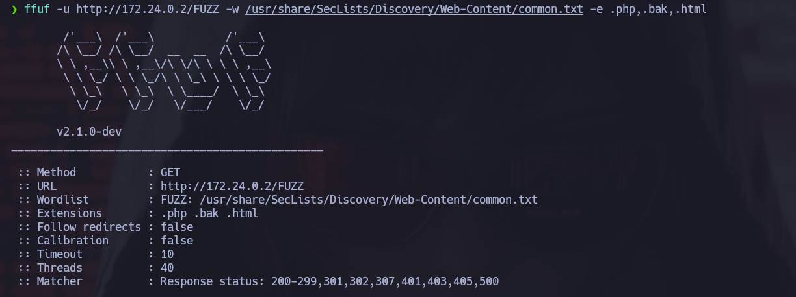

---
Y efectivamente me ha descubierto un archivo **secret.ph**:

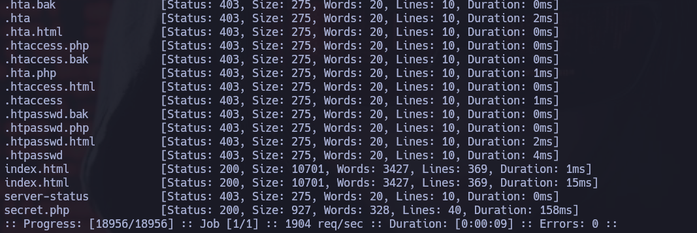

---

Y la ruta nos da un nombre:

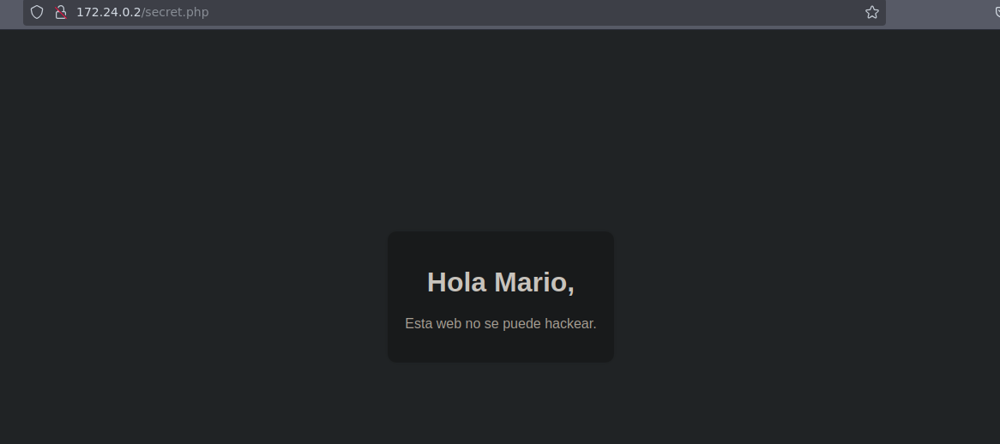

---

## 4. Explotación de vulnerabilidades

Ahora utilizaré fuerza bruta con hydra ya que tenemos un nombre:

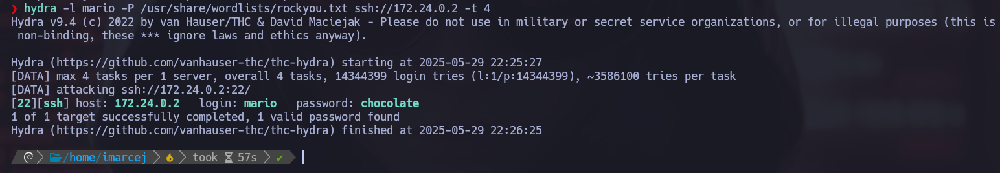

---

Y nos ha dado una contraseña, ahora intentaremos entrar por ssh:

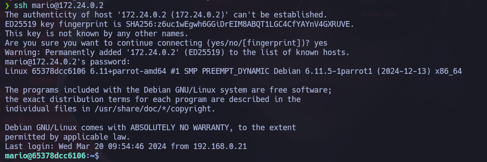

---

## 5. Escalada de Privilegios

Ya estando dentro, ejecutaré este comando para ver si puedo ejecutar algún comando como root sin contraseña:

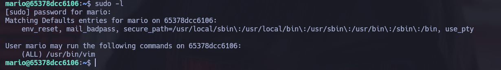

---

Esto significa que puedo ejecutar vim como root usando sudo, sin necesidad de contraseña.

El siguiente paso es obtener una shell como root ejecutando:

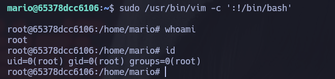

---

Y ya somos root, máquina resuelta exitosamente :)

📅 Resuelta el 29/05/25

👩 Por Marcela Jiménez (aka Mar)
🐉

