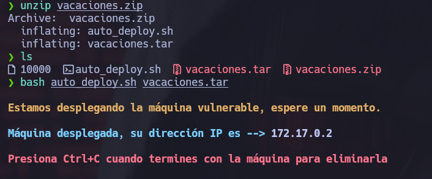
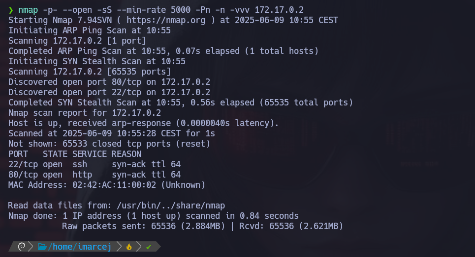
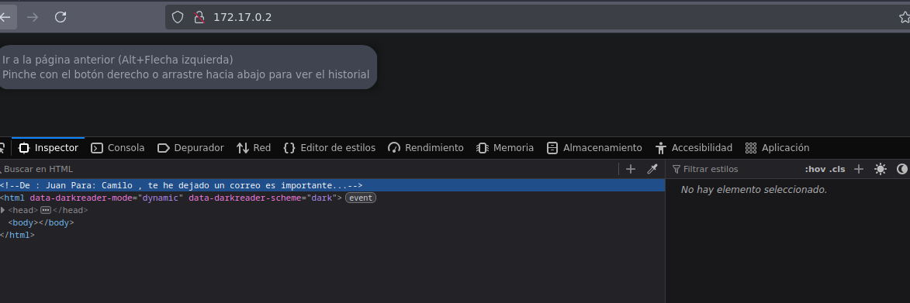
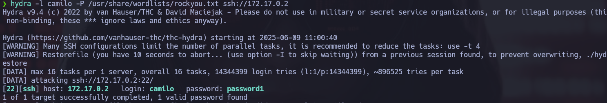
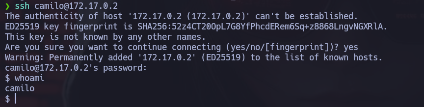
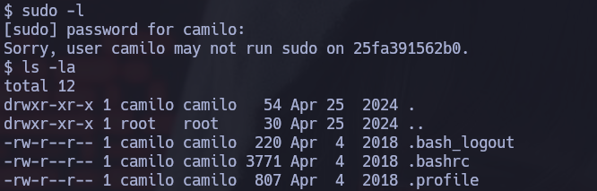
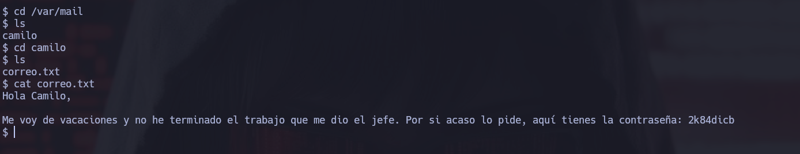
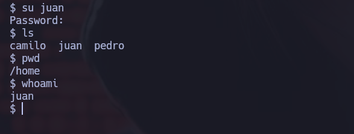
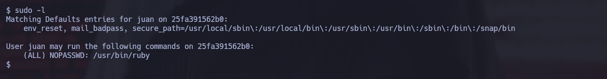
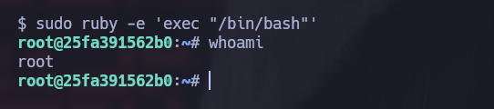

# 🧠 MÁQUINA VACACIONES

**Difícultad**: 🟢 Muy fácil

🔗 Puedes descargar la máquina desde aquí: [https://dockerlabs.es/](https://dockerlabs.es/)

---

## 1. Despliegue de la máquina vulnerable

---

## 2. Reconocimiento inicial con NMAP

Explicación detallada de cada parámetro:

- **-p-**: Hace un escaneo de todos los puertos (1-65535).
- **--open**: Muestra solo puertos abiertos.
- **-sS**: Nos permite hacer escaneos sigilosos y evitar la detección de firewall. Hace un escaneo de tipo SYN sin establecer conexión completa, y así evitar la detección del firewall.
- **--min-rate=5000**: Este parámetro nos ayuda a controlar la velocidad de los paquetes enviados y así poder hacer un escaneo más rápido con 5000 paquetes por segundo.
- **-Pn**: No realiza ping porque ya da por hecho que el host está activo.
- **-n**: No hace resolución DNS.
- **-vvv**: Modo verbose, para ir viendo información detallada en tiempo real.

Encontramos abiertos los puertos 22 y 80, vamos a escribir en el navegador: **http://172.17.0.2:80** para ver que hay en el puerto 80:

---

## 3. Búsqueda de vulnerabilidades

Al entrar en el navegador, he inspeccionado la página y nos han dejado una pista con esta frase...

---

## 4. Explotación de vulnerabilidades

Ahora aplicaré fuerza bruta con hydra, con el nombre de **Camilo** porque según la pista el mensaje es de **Juan** para **Camilo**:

---

Ahora que nos ha dado una contraseña, vamos a entrar por ssh:

---

Ahora ejecutaré **sudo -l** para ver si el usuario **camilo** puede ejecutar algún comando como root:

Y como hemos visto este usuario no puede ejecutar ningún comando como root.

Ahora lo que haré es buscar rutas donde puedan haber correos, por el nombre de la máquina para ver si encontramos alguna pista, que normalmente pueden estar en **/var/mail**:

Y si, nos han dado una pista, ahora vamos a entrar con **su** con el usuario de **Juan**:

## 5. Escalada de privilegios

Primero vamos a ver que puede ejecutar **Juan** como root:

Y ahora que hemos visto que podemos ejecutar ruby, procedemos:

Y ya somos root!

Máquina resuelta exitosamente:)

📅 Resuelta el 11/06/25

👩 Por Marcela Jiménez (aka Mar)
🐉

